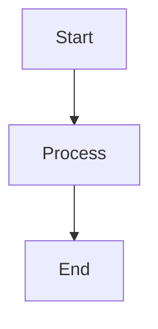

# Mermaid Preview for Zed


Render Mermaid diagrams as SVG images directly in your Markdown files.

## Features

- ⚡ **Zero-config install** - Auto-downloads versioned LSP binary on first use
- 🎨 **Clean preview** - Shows only rendered diagrams, no source code in preview
- 📝 **Editable source** - Source saved to separate `.mmd` files for easy editing
- 🔒 **Secure** - SVG output sanitized, files written only to project directory
- 🎯 **Proper text rendering** - Native SVG text with correct positioning for all diagram types
- 🚀 **Fast** - Works with any Mermaid diagram type
- ⚡ **Bulk rendering** - Render all diagrams at once with "Render All X Diagrams"

## Requirements

- [Mermaid CLI](https://github.com/mermaid-js/mermaid-cli) (`mmdc`)
- Install with: `npm install -g @mermaid-js/mermaid-cli`

## Installation

### Option 1: Install from Zed Extensions
1. Open Zed
2. Press `Cmd+Shift+P` (or `Ctrl+Shift+P`)
3. Type "Extensions: Install Development Extension"
4. Navigate to the cloned repository directory
5. Select it

### Option 2: Manual Installation
```bash
git clone https://github.com/dawsh2/zed-mermaid-preview.git
cd zed-mermaid-preview
./scripts/build.sh && ./scripts/install.sh
```

Restart Zed to load the extension.

## Usage

### Single Diagram
```markdown

Place cursor in block → Right-click → **"Render Mermaid Diagram"**

### Multiple Diagrams
When you have multiple mermaid blocks, use:
- **"Render All X Mermaid Diagrams"** - Renders all at once
- **"Render Mermaid Diagram"** - Renders only the current block

### Editing Rendered Diagrams
1. Place cursor on the HTML comment line (e.g., `<!-- mermaid-source-file:...-->`)
2. Right-click → **"Edit Mermaid Source"**
3. The original code block is restored for editing

**Note:** The "Edit Mermaid Source" action only appears when your cursor is on the HTML comment line, not on the image itself.

## File Structure

After rendering:
```
document.md              # Main markdown with images
document_diagram_0.svg   # Rendered diagram
document_diagram_0.mmd   # Source code (editable)
```

## Example

See [`example.md`](example.md) for various diagram types and complexity levels.

## How It Works

**Production (End Users):**
- Extension auto-downloads versioned LSP binary from GitHub releases on first use
- Binary cached at `~/.../Zed/extensions/work/mermaid-preview/mermaid-lsp-cache/v0.1.24/`
- Updates download to new versioned folders automatically
- No manual setup required!

**Development (Contributors):**
- LSP binary NOT in git (excluded via `.gitignore` to keep repo clean)
- You build locally and point extension to your build

## Development

### First-Time Setup
```bash
# Clone and setup development environment
git clone https://github.com/dawsh2/zed-mermaid-preview.git
cd zed-mermaid-preview

# One-time: Configure to use local builds
./scripts/dev-setup.sh

# Build everything
./scripts/build.sh

# Restart your terminal to pick up env var
# Then restart Zed
```

### Workflow
```bash
# Make changes to LSP code
vim lsp/src/render.rs

# Rebuild (MERMAID_LSP_PATH ensures Zed uses this)
cd lsp && cargo build --release

# Restart Zed to load changes
# Your local build is now active!

# Run tests
cargo test
```

### Without MERMAID_LSP_PATH
If you don't set the env var, Zed will use the cached download from GitHub. You'll need to manually copy after each build:
```bash
cp target/release/mermaid-lsp ~/Library/Application\ Support/Zed/extensions/work/mermaid-preview/mermaid-lsp-cache/v0.1.24/
```

### Release Process
```bash
# Package binaries for all platforms
./scripts/package-mermaid-lsp.sh <target>

# Bump version in extension.toml
# Create GitHub release with binaries
# Users auto-update!
```

## License

MIT
