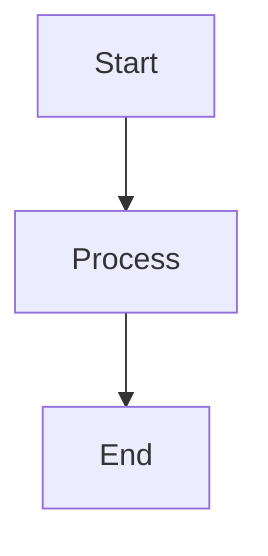

# Mermaid Preview for Zed


Render Mermaid diagrams as SVG images directly in your Markdown files.

## Features

- ⚡ **Bulk rendering** - Render all diagrams at once with "Render All X Diagrams"
- 🎨 **Clean preview** - Shows only rendered diagrams, no source code in preview
- 📝 **Editable source** - Source saved to separate `.mmd` files for easy editing
- 🔒 **Secure** - SVG output sanitized, files written only to project directory
- 🎯 **Perfectly centered labels** - Native SVG text rendering with proper label positioning
- 🚀 **Fast** - Works with any Mermaid diagram type

## Requirements

- [Mermaid CLI](https://github.com/mermaid-js/mermaid-cli) (`mmdc`)
- Install with: `npm install -g @mermaid-js/mermaid-cli`

## Installation

### Option 1: Install from Zed Extensions
1. Open Zed
2. Press `Cmd+Shift+P` (or `Ctrl+Shift+P`)
3. Type "Extensions: Install Development Extension"
4. Navigate to the cloned repository directory
5. Select it

### Option 2: Manual Installation
```bash
git clone https://github.com/dawsh2/zed-mermaid-preview.git
cd zed-mermaid-preview
./scripts/build.sh && ./scripts/install.sh
```

Restart Zed to load the extension.

## Usage

### Single Diagram
```markdown

Place cursor in block → Right-click → **"Render Mermaid Diagram"**

### Multiple Diagrams
When you have multiple mermaid blocks, use:
- **"Render All X Mermaid Diagrams"** - Renders all at once
- **"Render Mermaid Diagram"** - Renders only the current block

### Editing Rendered Diagrams
1. Click on the rendered image
2. Right-click → **"Edit Mermaid Source"**
3. The original code block is restored for editing

## File Structure

After rendering:
```
document.md              # Main markdown with images
document_diagram_0.svg   # Rendered diagram
document_diagram_0.mmd   # Source code (editable)
```

## Example

See [`example.md`](example.md) for various diagram types and complexity levels.

## Development

```bash
# Build
./scripts/build.sh

# Test
cd lsp && cargo test

# Package for release
./scripts/package-mermaid-lsp.sh <target>
```

## License

MIT
