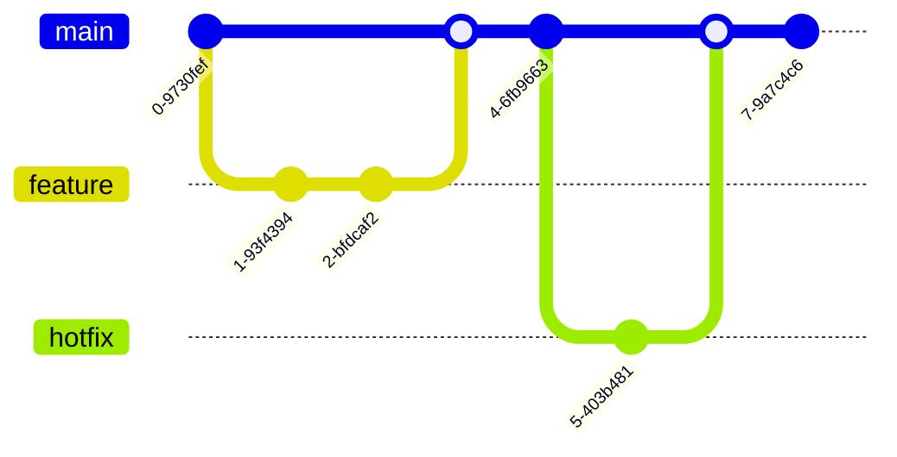

# Mermaid Preview Examples

This file demonstrates various Mermaid diagram types that you can render with the extension.

## Simple Flowchart


## Complex Flowchart with Decision Points

```mermaid
flowchart TD
    A[Start Process]:::start --> B{Is data valid?}:::decision
    B -->|Yes| C[Process Data]:::process
    B -->|No| D[Log Error]:::error
    C --> E{Success?}:::decision
    E -->|Yes| F[Save Results]:::success
    E -->|No| G[Retry]:::warning
    D --> H[Notify User]:::warning
    F --> I[End]:::end
    G --> C
    H --> I

    classDef start fill:#90EE90,stroke:#333,stroke-width:3px
    classDef decision fill:#FFD700,stroke:#333,stroke-width:2px
    classDef process fill:#87CEEB,stroke:#333,stroke-width:2px
    classDef success fill:#98FB98,stroke:#333,stroke-width:2px
    classDef error fill:#FF6B6B,stroke:#333,stroke-width:2px
    classDef warning fill:#FFA500,stroke:#333,stroke-width:2px
    classDef end fill:#DDA0DD,stroke:#333,stroke-width:3px
```

## Sequence Diagram


## Class Diagram


## State Diagram


## Gantt Chart


## Pie Chart


## Journey Map


## Git Graph



## Entity Relationship Diagram


## User Journey


## Mind Map


## Quadrant Chart


## Usage

1. Place your cursor in any of the mermaid code blocks above
2. Right-click and select **"Render Mermaid Diagram"**
3. Or select **"Render All X Mermaid Diagrams"** to render all at once
4. The source code will be saved to separate `.mmd` files for editing
5. Use **"Edit Mermaid Source"** on rendered images to restore the code blocks

Each diagram type demonstrates different capabilities of Mermaid and how the extension handles them. Try rendering them all at once with the bulk render feature!