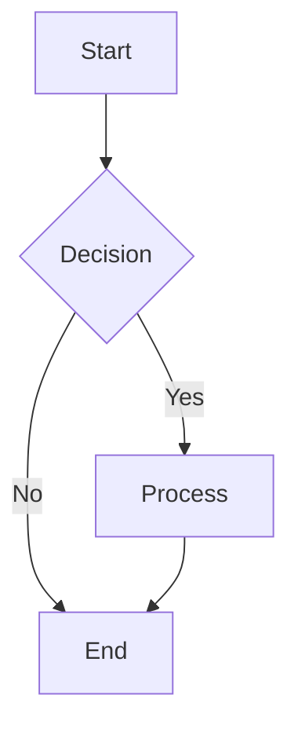

# Test Edit Functionality

## Diagram 1

## After Rendering

Once you render this, it should look like:

<!-- mermaid-source-file:.mermaid/test-edit-functionality_1730305000_0.mmd -->

To edit: Place your cursor on any of the lines above (comment or image line) and the "Edit Mermaid Source" action should appear.