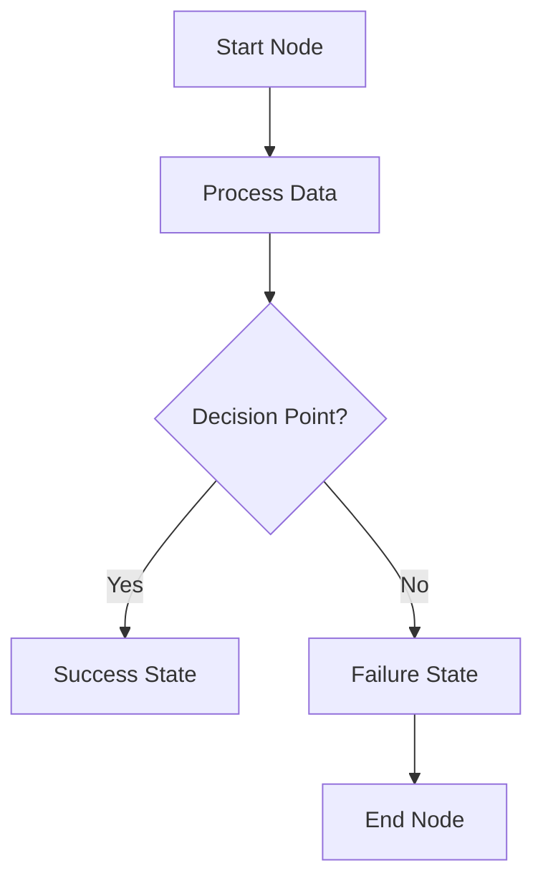
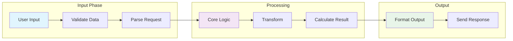
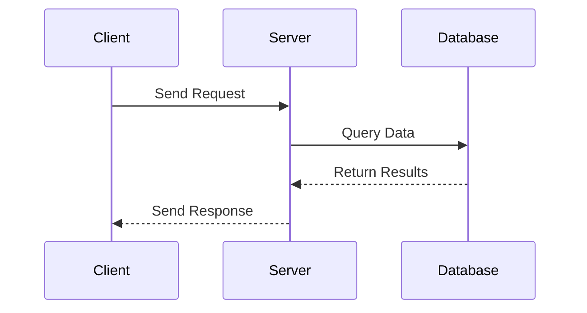

# Test Mermaid Labels - v0.1.21

This test file verifies that all labels are visible with the new mermaid-preview extension v0.1.21 that uses the built-in `htmlLabels: false` configuration.

## Simple Flowchart

## Complex Diagram with Multiple Node Types

## Sequence Diagram

All labels should be visible:
- Node labels: Start Node, Process Data, Decision Point?, etc.
- Edge labels: Yes, No, Send Request, etc.
- Subgraph labels: Input Phase, Processing, Output

The diagrams should render with proper SVG text elements instead of foreignObject elements.