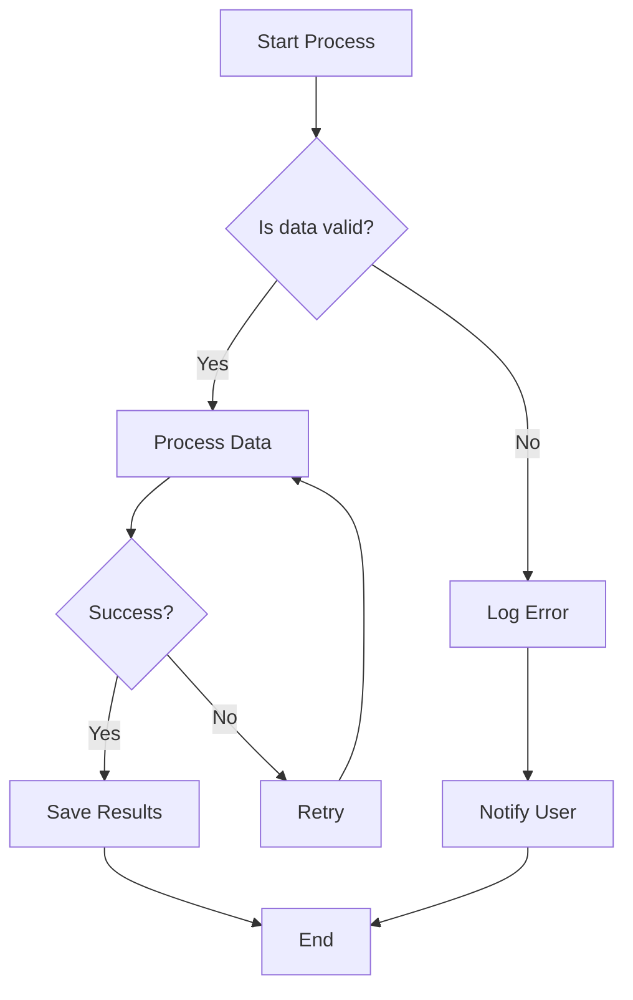

# Test Mermaid Diagram

## Simple Flowchart Test

```mermaid
flowchart LR
    A[Start] --> B[Process]
    B --> C[End]
```

## Complex Flowchart Test

```mermaid
flowchart TD
    A[Start Process] --> B{Is data valid?}
    B -->|Yes| C[Process Data]
    B -->|No| D[Log Error]
    C --> E{Success?}
    E -->|Yes| F[Save Results]
    E -->|No| G[Retry]
    D --> H[Notify User]
    F --> I[End]
    G --> C
    H --> I
```

This should render with all labels visible.